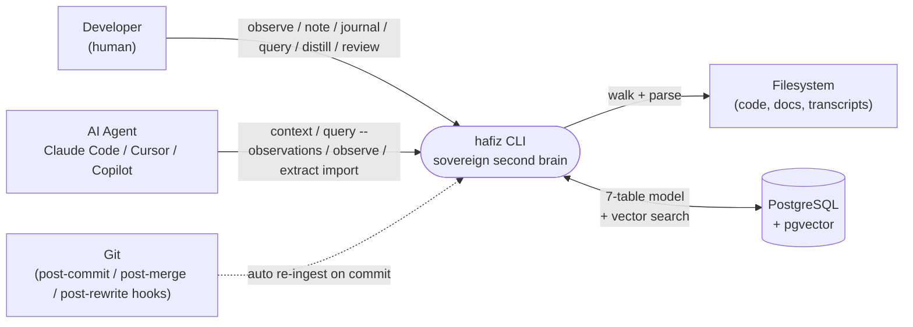
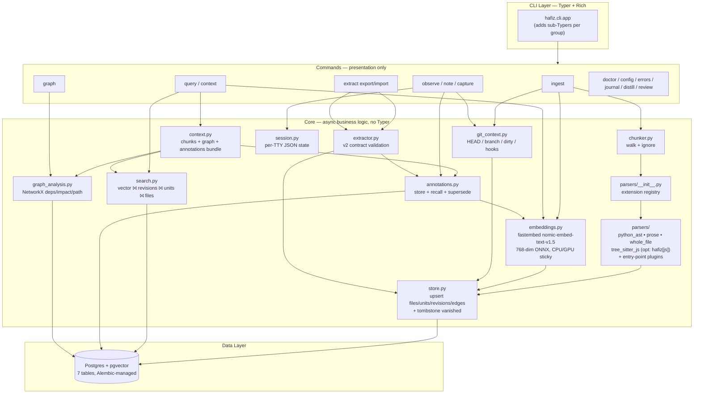
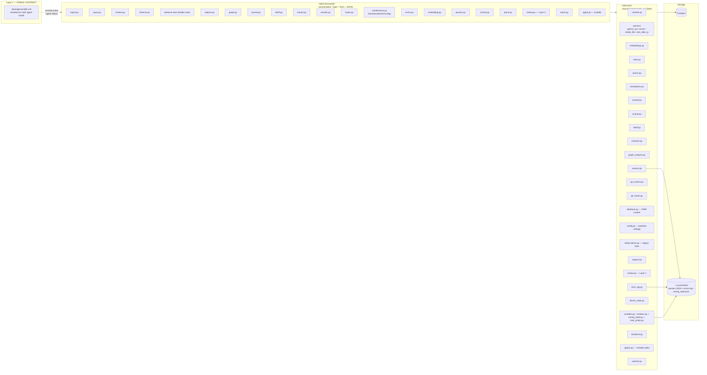
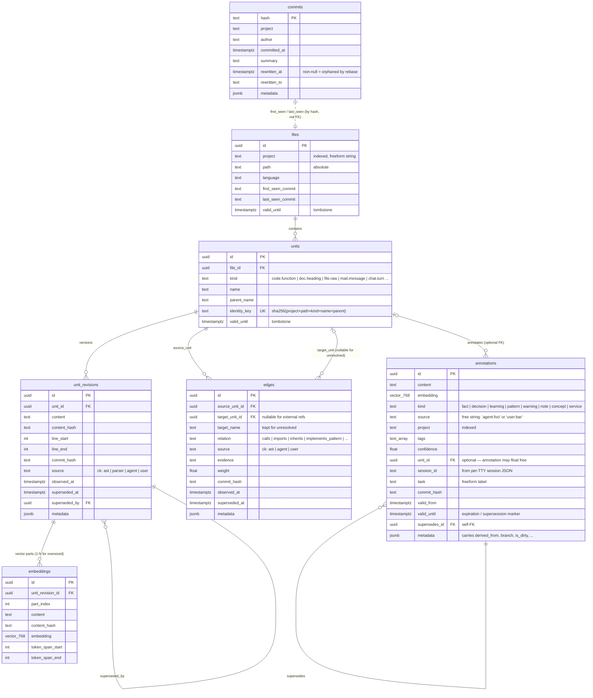
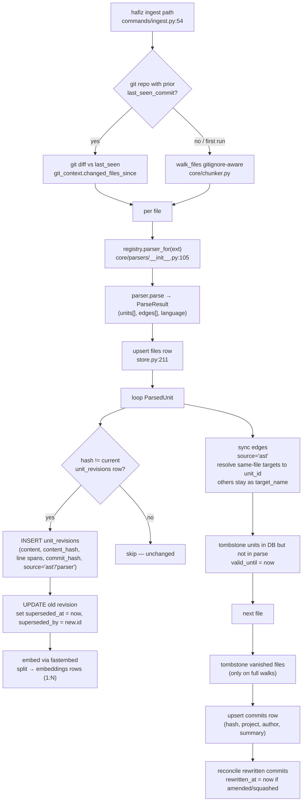
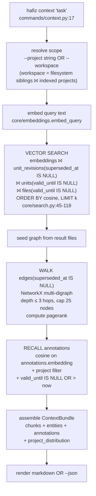

# Hafiz — Architecture & Capture Analysis

A code-grounded picture of what Hafiz is, how its pieces fit, and **what kinds of things it can and cannot record today**. The first half zooms in (context → architecture → modules → schema → flows). The second half flips the lens: given the schema and flows we have, *how do we capture* the entity types we care about (people, process, credentials, project, solution, workspace, reports, repeatable tasks) — and where are the gaps?

All citations point at code, not docs.

---

## Level 1 — Context

Who uses Hafiz, why, and through which surfaces.

**What it does for users today (grounded in shipped commands):**

| Surface | What it gives |
|---|---|
| **Index** — `ingest`, `hooks install` | Parses code (Python AST), prose (Markdown/RST/TXT), and any other file (whole-file fallback) into stable units + embeddings. Diff-driven on re-runs ([commands/ingest.py:110-122](../hafiz/commands/ingest.py#L110-L122)). |
| **Recall** — `query`, `query --observations`, `context` | Vector search over indexed bodies; vector search over annotations (`--observations`, formerly `--recall`); combined "context bundle" of chunks + graph neighborhood + annotations for a task ([core/context.py:175-186](../hafiz/core/context.py#L175-L186)). |
| **Reason** — `graph deps/impact/path/rank/show/stats` | Walks the AST-derived edge table to answer blast-radius and dependency questions. |
| **Remember** — `observe`, `note`, `capture` | Persists decisions, learnings, warnings, raw notes; auto-tags git commit, branch, session, task. |
| **Curate** — `journal`, `distill`, `review` | Time-windowed digests of what was recorded; surfaces promotable notes; (Layer 2 self-review is still a stub). |
| **Operate** — `doctor`, `config`, `errors`, `embedding` | Self-tuning per host, sovereign error log, embedding device fallback. |
| **Integrate** — `agent install`, `extract export/import` | Splices the canonical `skills.md` into agent configs; lets agents bulk-attach annotations + semantic edges to the AST graph. |

The user is rarely "using Hafiz" in isolation. The intended loop is: **agent reads context → agent writes work → agent observes decisions → user reviews via journal/distill → user supersedes when things change.** The CLI is the contract; the database is the state; the `skills.md` is the protocol.

---

## Level 2 — Architecture (how ingestion works, end to end)

Runtime layering and the two main pipelines (ingest + retrieval).

**Three load-bearing invariants** ([CLAUDE.md](../CLAUDE.md), [core/database.py:1-23](../hafiz/core/database.py#L1-L23)):

1. **Identity / body / embedding are separate.** `units` carry stable identity; `unit_revisions` carry append-only bodies; `embeddings` carry vectors. A renamed function and a re-flowed paragraph survive without orphaning their annotations.
2. **Parsers own structure; agents own meaning.** The check constraints `ck_unit_revisions_source` and `ck_edges_source` ([database.py:199-203](../hafiz/core/database.py#L199-L203), [database.py:296-300](../hafiz/core/database.py#L296-L300)) enforce the split at the DB layer.
3. **Async end-to-end.** Every DB-touching function is `async def`; commands wrap with `asyncio.run(...)`. No blocking calls inside the loop ([CLAUDE.md "Conventions"](../CLAUDE.md)).

---

## Level 3 — Module Map

The `commands/` ↔ `core/` split, plus the Layer 1 (stable agent contract) vs Layer 2 (evolving) boundary.

The split is defended in code:

- `hafiz/core/` has **zero** `import typer` or `from rich` lines — verifiable via grep. Anything user-facing (panels, exit codes, `--json` shaping) is in `hafiz/commands/`.
- The Layer 1 / Layer 2 boundary is documented in the project [CLAUDE.md](../CLAUDE.md) and enforced socially: changes to [data/agents/skills.md](../hafiz/data/agents/skills.md) ripple to every installed agent.

---

## Level 4 — Data Model (the seven tables)

The schema is intentionally narrow. Everything Hafiz knows lives here.

A few things worth saying out loud about the schema as it stands:

- **Project is the only first-class scope.** It's a string column on `files`, `units` (via `file_id`), `commits`, and `annotations`. There is no `solution`, `workspace`, `team`, `person`, `credential`, or `task_definition` table. This is a deliberate choice (parsers own structure, agents own meaning) — but it means anything that isn't a unit or an annotation has to live in `metadata` JSONB, in `tags[]`, or as a string in `source`/`task`.
- **Temporal axes are first-class.** `valid_until` (tombstone), `superseded_at` / `superseded_by` (revision history), `valid_from` / `valid_until` / `supersedes_id` (annotation history), `rewritten_at` / `rewritten_to` (commit rewrites). Hafiz never deletes; it tombstones. Time-travel queries are possible without a separate audit table.
- **`metadata` JSONB is the escape hatch.** Used today on annotations to carry `derived_from`, branch info, dirty state. Anything we want to capture that isn't already a column lands here — which is fine for low-volume agent metadata, but a poor substitute for first-class storage when the field becomes load-bearing.
- **Old tables are gone, not deprecated.** `chunks`, `entities`, `relations`, `observations` were dropped in migration 0005 ([alembic/versions/0005_structural_grounding.py](../alembic/versions/0005_structural_grounding.py)). The class names exist as `_RemovedInV5` stubs ([core/database.py:374-400](../hafiz/core/database.py#L374-L400)) that raise loudly if instantiated. Don't reach for them.

---

## Level 5 — Key Flows (at code level)

Three flows make Hafiz tick. Every line below is grounded in code.

### 5.1 Ingest pipeline

Key code references:
- Entry: [commands/ingest.py:54](../hafiz/commands/ingest.py#L54) (`run_ingest`)
- Diff scope: [commands/ingest.py:110-122](../hafiz/commands/ingest.py#L110-L122)
- Per-file transaction: [core/store.py:179-350](../hafiz/core/store.py#L179-L350)
- Hash-based revision skipping: [core/store.py:222-272](../hafiz/core/store.py#L222-L272)
- Embedding splitting: [core/store.py:278-313](../hafiz/core/store.py#L278-L313) (uses `prepare_embedding_parts`, max-part-chars is a tunable)

**Idempotency & cost:** Hash-aware. Re-ingesting an unchanged tree writes zero `unit_revisions` and zero `embeddings` rows. Branch switches re-parse only `git diff`'d files. The expensive op (embedding) only fires on changed bodies.

### 5.2 Context bundle assembly

Key code: [core/context.py:175-186](../hafiz/core/context.py#L175-L186), [core/search.py:45-118](../hafiz/core/search.py#L45-L118), [core/annotations.py:143-200](../hafiz/core/annotations.py#L143-L200), [core/context.py:225-258](../hafiz/core/context.py#L225-L258) (workspace resolution).

**Relevance is purely vector cosine** today — no keyword fallback, no recency boost, no usage signal. Project filtering is an exact-string match.

### 5.3 Observe → Distill → Supersede

```mermaid
flowchart TB
    subgraph capture["CAPTURE"]
        A1["hafiz note 'half-formed thought'"] --> A2["INSERT annotations<br>kind='note'<br>session_id + task auto-tagged from per-TTY session JSON<br>commit_hash + branch + is_dirty auto-captured<br>core/annotations.py:46-140"]
    end

    subgraph commit["COMMIT"]
        B1["hafiz observe '...' --type decision"] --> B2["INSERT annotations<br>kind='decision' (or fact/learning/pattern/warning)<br>same auto-tagging"]
        B2 --> B3{"--supersedes provided?"}
        B3 -->|yes| B4["UPDATE old.valid_until = now"]
        B4 --> B5["new.supersedes_id = old.id"]
        B3 -->|no| B6["done"]
    end

    subgraph distill["DISTILL (scanner, no LLM call)"]
        C1["hafiz distill --since 7d"] --> C2["SELECT FROM annotations<br>kind='note'<br>+ valid_from in window<br>+ active (valid_until IS NULL OR > now)<br>+ project/session/task filters"]
        C2 --> C3["return DistillBundle<br>list[NoteCandidate]"]
        C3 --> C4["user reviews → picks notes to promote"]
        C4 --> C5["hafiz observe 'distilled decision'<br>--type decision<br>--derived-from id1,id2,id3"]
        C5 --> C6["new annotation<br>metadata.derived_from = [id1,id2,id3]<br>(originals NOT superseded — lineage only)"]
    end
```

Key code: [core/annotations.py:46-140](../hafiz/core/annotations.py#L46-L140) (store + supersede), [core/annotations.py:129-136](../hafiz/core/annotations.py#L129-L136) (supersede mechanics), [core/distill.py:49-122](../hafiz/core/distill.py#L49-L122) (candidate query), [core/session.py:70-123](../hafiz/core/session.py#L70-L123) (auto-tag source).

**Two non-obvious things:**
- **Distill does not rank.** All `kind=note` rows in the window are candidates. Ranking is the human's job (or a future Layer 2 review's). There is no LLM call inside Hafiz at any point.
- **`--supersedes` and `--derived-from` are different.** Supersession **invalidates** the old (sets `valid_until = now`); derived-from **preserves** it (just records lineage in metadata). Use the first when an old decision is *replaced*; use the second when several notes *informed* a new decision.

---

## Capability Analysis — What We Capture, What We Don't

This is the question that matters. Given the schema and flows above, **how does Hafiz today represent each kind of thing the user wants captured?** Honest answers, code-grounded.

### The matrix

| Entity type | Representation today | Storage | First-class? | Code evidence |
|---|---|---|---|---|
| **People** | Free-text string in `Annotation.source` (e.g. `"user:irshad"`, `"agent:claude-code"`) and `Commit.author` | annotations.source, commits.author | No — second-class via strings | [core/database.py:322](../hafiz/core/database.py#L322), [core/database.py:61](../hafiz/core/database.py#L61) |
| **Process / workflow** | Per-TTY ephemeral session (JSON file in `~/.cache/hafiz/`) + `Annotation.task` freeform string | annotations.session_id (text), annotations.task (text), `~/.cache/hafiz/session-{tty}.json` | No — second-class label only | [core/session.py:48-123](../hafiz/core/session.py#L48-L123), [core/database.py:331-332](../hafiz/core/database.py#L331-L332) |
| **Credentials / secrets** | Not represented anywhere. No storage, no redaction in parsers, no scrubbing in ingest. | None | No — absent | grep across repo confirms zero columns / zero redaction logic |
| **Project** | First-class string column, indexed on every relevant table | files.project, units (via file_id), commits.project, annotations.project | Yes — but as a **string**, not a typed entity | [core/database.py:89](../hafiz/core/database.py#L89), [core/database.py:60](../hafiz/core/database.py#L60), [core/database.py:323](../hafiz/core/database.py#L323) |
| **Solution** (logical product / service grouping above project) | Not represented. No "solution" anywhere in schema or code. | None | No — absent | No matches in `core/` |
| **Workspace** (group of projects) | Pydantic config block + runtime filesystem-walk that matches sibling dirs against indexed `File.project` strings | `WorkspaceSettings` in hafiz.toml + `resolve_workspace_projects()` ephemeral computation; **no DB column** | No — derived, not stored | [core/config.py:91-103](../hafiz/core/config.py#L91-L103), [core/context.py:225-258](../hafiz/core/context.py#L225-L258) |
| **Reports** | Generated on-demand from queries; never persisted | None — `journal`, `distill`, `review` all build views from `annotations` rows live | No — ephemeral | [core/journal.py:85-150](../hafiz/core/journal.py#L85-L150), [core/distill.py:49-122](../hafiz/core/distill.py#L49-L122) |
| **Standalone repeatable tasks / runbooks** | Not represented. `Annotation.task` is a freeform string label only. No definition, no schedule, no execution history. | None (only `task: text` label) | No — absent | [core/database.py:332](../hafiz/core/database.py#L332) — the field is a label, not a definition |

### Per-entity discussion

#### People

Hafiz tracks **who said what** but does not model **who anyone is**. The `source` column on `annotations` is a free string with the convention `agent:<name>` or `user:<name>` — there's no validation, no lookup table, no roles, no contact info, no team membership. Two annotations with `source="user:irshad"` and `source="user:Irshad"` are unrelated as far as the DB is concerned.

`Commit.author` mirrors the git author string verbatim. There's no normalization to align "Irshad Ali" (git) with "user:irshad" (observe).

This is fine for a personal second-brain. It breaks the moment Hafiz is shared across a team and you want to ask "what has Anjum decided about auth in the last quarter?" — the answer requires a person identity layer that doesn't exist today.

#### Process / workflow

Two adjacent things, both thin:

1. **Session** — a per-TTY JSON file at `~/.cache/hafiz/session-{tty}.json` ([core/session.py:31-67](../hafiz/core/session.py#L31-L67)). Holds `{session_id, name, task, project, started_at, tty}`. Auto-tags subsequent `observe` / `note` / `capture` calls in the same shell. Lives **outside the DB entirely**; ends when you `hafiz session end` or close the shell.
2. **Task** — a freeform string column on `annotations` ([core/database.py:332](../hafiz/core/database.py#L332)). Used only for filtering in journal/distill. There is no task definition, no list of tasks, no schedule, no dependency graph between tasks.

What's missing for "process":
- A **workflow definition** — e.g., "publish blog post" = [draft → review → SEO → publish → tweet], each step a knowable thing.
- **Cron / schedule** — Hafiz has no scheduler. The recently shipped self-tuning cron infrastructure (`schedule` skill) is a Claude Code feature, not a Hafiz one.
- **Process state** — given a workflow with steps, where am I right now? Today: nowhere.

#### Credentials / secrets

Not represented. Worth flagging that there is also **no scrubbing layer in ingest** — if you `hafiz ingest` a directory containing a `.env`, the values land in `unit_revisions.content` and in `embeddings.content`. The `.gitignore`/`.hafizignore` filtering helps, but there is no opt-in redactor for matched-but-sensitive content. This is a hazard worth a separate work item before sharing the index across machines.

#### Project

The only first-class scope dimension. Indexed on `files`, `commits`, `annotations`. Resolved as a freeform string at ingest time (`hafiz ingest --project hafiz`) and as a filter at query time. No naming validation, no aliases, no rename support.

A project name change today means: re-ingest under the new name, manually re-tag old annotations, accept that `commits.project` will mix old and new. There is no `ALTER PROJECT` operation.

#### Solution

Absent. There is no concept of "the auth solution spans the `auth-api`, `auth-web`, and `shared-types` projects." If you want to ask a cross-project question today, you either use `--workspace` (which is a filesystem heuristic, not a stored relationship) or pass multiple `--project` filters and union manually.

#### Workspace

The most quietly clever and most fragile concept in the codebase. There **is no workspace table**. A workspace is computed on-the-fly by `resolve_workspace_projects()`:

1. List sibling directories of `cwd.parent`.
2. Pull distinct `File.project` values from the DB.
3. Match dir names against project names (exact, then normalized: lowercase, strip `-`/`_`).
4. Return the matched project list.

This works because most users keep `~/workspace/proj-a/`, `~/workspace/proj-b/` and treat the parent dir as their workspace. It breaks if:
- Project directories live in different parents.
- A directory is renamed while keeping the indexed project name.
- You want a workspace that isn't a filesystem grouping (e.g., "all auth-related projects regardless of location").

Workspace ignore patterns and root path live in `hafiz.toml` ([core/config.py:91-103](../hafiz/core/config.py#L91-L103)) but the `projects = [...]` list is optional and most people don't fill it in — the filesystem heuristic does the work.

#### Reports

Three commands generate report-shaped output: `journal`, `distill`, `review`. **None persist the report.** Every invocation re-queries `annotations` live. This is the right default — reports stay current, no stale rendering — but it means:

- No "what did I think a month ago" snapshot. (You can replay via `--day` / `--since`, but the *report* itself isn't preserved.)
- No subscription / scheduled-report concept.
- No diffing two reports.

`hafiz review` is a Layer 2 stub today; the `self-review-curation-loop` work item ([workitems/active/self-review-curation-loop.md](../workitems/active/self-review-curation-loop.md)) plans to make it the proposal-generation surface — but even that ships report-as-output, not report-as-stored-entity.

#### Standalone repeatable tasks / runbooks

Absent as a concept. The `task` column on annotations is a label that says "this observation belongs to thread X" — it does **not** say "thread X is a runbook with steps Y and Z that I want to invoke again." There is no `task_definitions` table, no step model, no input/output schema, no execution log.

If you wanted to record "the steps I take every Monday to triage PRs," today you'd write it as a markdown file, ingest it via the prose parser, and recall it via `hafiz query`. That works, but it gives you a *document about a runbook*, not a *runbook*.

---

## Where the gaps point

Without prescribing solutions, the matrix groups the gaps into three tiers by how much new schema they need:

**Tier 1 — Composable on existing schema (cheap):**
- **People as a typed entity.** A `units` row of `kind="person.identity"` plus aliases in `metadata` would normalize source strings and commit authors, with zero new tables. Annotations and edges work as-is.
- **Solutions as a unit kind.** `kind="solution.scope"` units, with `edges(relation="contained_in_solution")` from project units, would give cross-project grouping without a new table.
- **Workspace as a stored unit.** Promote workspaces from filesystem heuristic to `kind="workspace.scope"` units, with explicit `member_of` edges to projects. The heuristic stays as a *bootstrap* path, not the source of truth.

**Tier 2 — Wants real schema, fits existing patterns (medium):**
- **Runbooks / repeatable tasks** as a unit kind (`kind="runbook.definition"`), with revisions for versioning and edges (`runbook.uses_resource`, `runbook.depends_on`). The `task` column on annotations stays as the *invocation* label that ties observations to a *run* of a runbook.
- **Reports as persisted snapshots.** A `kind="report.snapshot"` unit captures the rendered output at a moment in time, while still letting `journal/distill/review` generate live views by default.
- **Process / workflow state.** Either: (a) extend the session JSON model into a DB table with multi-step state, or (b) treat workflows as a sequence of `kind="workflow.step"` units linked by `next_step` edges, with state-tracking annotations.

**Tier 3 — Cross-cutting, needs care (expensive):**
- **Credentials handling** — not "store credentials," but the *opposite*: an opt-in redaction layer in the parser/ingest pipeline so secrets never land in `unit_revisions.content` or `embeddings.content` in the first place. This is closer to a security work item than a schema one.
- **Person ↔ commit-author normalization.** Even with a person unit kind, mapping git authors to person identities is a fuzzy-matching problem. Tractable but not a one-day fix.

The shape of all three tiers is the same: **lean on the existing seven-table model — units carry typed identities, revisions carry bodies, edges carry relations, annotations carry meaning** — rather than adding domain-specific tables. The schema invariants ([Level 4](#level-4--data-model-the-seven-tables)) were designed exactly for this kind of extension. The hard work is mostly about (a) deciding what `kind` namespaces to spend, (b) deciding what relations are agent-writable vs parser-only, and (c) building the small amount of CLI ergonomic on top — not about reworking the foundation.

---

## Storage layers — knowledge vs source

The Tier-1/2/3 framing above absorbs almost every domain into the seven-table knowledge model. But there is one shape it absorbs *poorly*: **high-volume, time-series, immutable streams** — agent transcripts, chat threads, terminal events, tool-call traces. Forcing those into `units` + `unit_revisions` works mechanically but fights the model: revisions never revise, embedding-first access is the wrong primary index, and the wisdom layer drowns under firehose volume.

So Hafiz commits to **two storage layers**, not one:

| | **Knowledge layer** *(the seven tables)* | **Source layer** *(promoted dedicated tables)* |
|---|---|---|
| Examples | functions, docs, people, projects, decisions, learnings, patterns, runbooks | conversations, messages, events, traces |
| Volume | low–mid (1K–100K rows / project) | high (1M+ rows / project) |
| Lifecycle | identity stable, body revises | immutable, append-only, retention-bounded |
| Access pattern | embedding-first, identity-keyed | sequence/time-keyed, recent-N, aggregations |
| Specialized columns | a few + JSONB metadata | many — `seq`, `ts`, `role`, `author` are first-class |
| Survival horizon | permanent (tombstone-able) | bounded retention (auto-sweep) |
| Default visibility | surfaced by `hafiz query` / `context` | hidden from default queries; opt-in via `hafiz recall` |

**Annotations bridge the layers.** A `decision` annotation can `--derived-from` either another annotation (knowledge→knowledge) *or* a sequence of message ids (knowledge→source). Source rows are *citations*; annotations are the *citers*. This strengthens the wisdom layer rather than replacing it: distillations finally have something concrete to point at.

### Promotion rule — when to add a dedicated table

Default to `units.kind` namespacing. Promote to a dedicated table only when **all three** of the following hold:

1. **Volume** — expected rows per project > ~100K, or growth is unbounded by user activity rather than codebase size.
2. **First-class columns** — at least three columns warrant their own indexes (sequence numbers, foreign keys, timestamps you actually filter on, structured payloads). JSONB metadata is no longer the right home.
3. **Lifecycle differs materially** — immutable vs revisable, bounded retention vs permanent, time-series vs identity-keyed.

Communications + messages pass on all three (high volume, `seq`/`role`/`ts`/`author` are first-class, immutable + retention-bounded). Runbook executions, metric snapshots, and reports as proposed in second-brain-coverage *do not* — they stay in the knowledge layer until pain forces re-evaluation.

The rule is what stops sprawl. Without it, every new domain argues for its own table.

### Source-layer obligations

Any table promoted to the source layer must ship with:

- **Bounded retention as a column** (`retention_until` or equivalent). A single sweeper job tombstones across all source tables uniformly.
- **Default exclusion from `hafiz query` / `hafiz context`.** Source rows surface only via dedicated commands (`hafiz recall`) or explicit opt-in flags. The wisdom layer must remain primary.
- **Raw is canonical, embedding is derived.** Content columns are required; embedding columns are nullable, populated selectively per a documented policy. Storing a vector without the source it was derived from inverts the source-of-truth relationship and creates a write-only black box.
- **Polymorphic annotation linkage.** Annotations may `derived_from` source rows; the link mechanism (today: `metadata.derived_from`) extends via the `annotation_targets` pivot when first-class is needed.

### What this is *not*

Two storage layers does not mean two databases, two query languages, or two sets of conventions. It means:

- Same Postgres. Same async ORM. Same migrations.
- Same `--project` / `--workspace` scoping.
- Same auto-tagging discipline (commit hash, branch, session).
- Just two qualitatively different *shapes* of table, with crisp rules about which shape new domains earn.

---

## How to read this doc going forward

- **Diagrams stay close to code.** When you change [core/store.py](../hafiz/core/store.py), the ingest flow diagram lies. When you add a parser, Level 5 needs a row.
- **Cite file:line, not concepts.** This doc is most useful as a map back into the source.
- **Mermaid renders inline** in VSCode and on GitHub. If you need pixel-perfect diagrams (board, slide deck), export with the Mermaid CLI; don't re-draw by hand.
- **Reality check before recommending.** Before proposing changes informed by this doc, re-grep for the file:line citations — code rots faster than diagrams.
